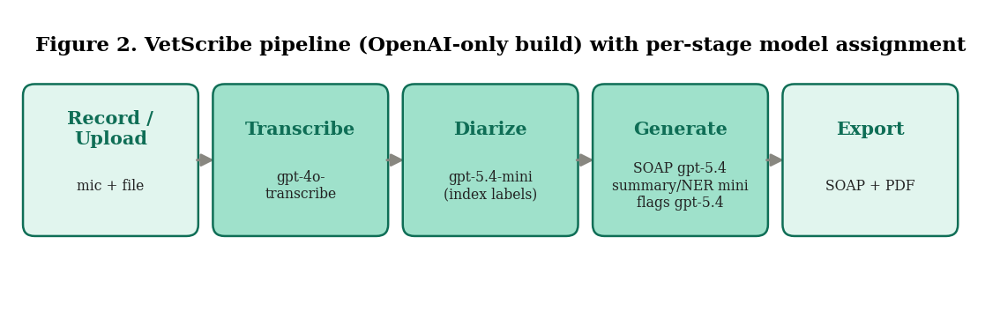

# 🩺 VetScribe

**An open-source pipeline for automated veterinary consultation documentation.**
Record a consult → get a structured SOAP note, a plain-language owner summary,
clinical entities, an automated "research-flag" gap analysis, and a PDF — at a
measured cost of about **$0.10 per consultation**.

> ⚠️ **Research prototype, not a medical device.** Every note is AI-generated and
> must be verified by a licensed clinician before use. Do **not** upload real,
> identifiable patient/client recordings to a public demo.

VetScribe is the software artifact accompanying the manuscript *"VetScribe: An
Open-Source Pipeline for Automated Veterinary Consultation Documentation — System
Design, Cost–Latency Analysis, and a Projected-Savings Model"* (see `paper/`).

---

## What it does

```
Record / Upload → Transcribe → Diarize → Generate (SOAP · summary · entities · flags) → Export PDF
```



- 🎙️ **Record or upload** a consultation (in-browser mic with pause/stop, or file upload), with playback.
- ✍️ **Whisper transcription** (`gpt-4o-transcribe`) of the full consult.
- 🗣️ **Speaker attribution** (Vet vs. Owner) via an index-based, transcript-preserving method.
- 📋 **SOAP note** generation with a non-removable "clinician must verify" disclaimer.
- 🐾 **Owner discharge summary** in plain language.
- 🔖 **Clinical entity extraction** (findings, differentials, procedures, drugs, follow-up).
- 🚩 **Research flags** — an automated human–AI gap analysis that surfaces items raised in the consult but under-represented in the note.
- 📄 **PDF export** of the current consult and of any past case.
- 🗂️ **Case history** (text only, never audio) so prior consults can be reviewed and re-exported.
- 💸 **Cost controls**: per-stage model tiering, per-session caps, and a global daily budget kill-switch.

---

## Quickstart (local)

**Requirements:** Python 3.11+ and an OpenAI API key.

```bash
# 1. install dependencies (a virtual environment is recommended)
pip install -r requirements.txt

# 2. provide your key — copy the example and paste your key into it
cp .env.example .env
#   then edit .env and set OPENAI_API_KEY=sk-...

# 3. run
python app.py
```

Open the printed local URL (`http://127.0.0.1:7860`) in your browser.

**Windows users:** double-click `RUN_VETSCRIBE.bat` — it builds an isolated
environment, installs dependencies, runs a smoke test, and launches the app.

**Smoke test (no audio, ~$0.02):**
```bash
python smoke_test.py            # built-in sample transcript
python smoke_test.py --audio your_clip.wav
```

---

## 🔑 API keys & cost protection — read before deploying publicly

VetScribe supports two key modes:

1. **Local / single-user:** put your key in a `.env` file (git-ignored). Never commit it.
2. **Bring-Your-Own-Key (BYOK):** each user pastes *their own* key into the app's
   "Your OpenAI API key" field. It is used only for their session and **never
   stored on the server.** This is the recommended mode for any public demo — the
   operator's key is never exposed, so your token exposure is zero.

If you ever run a public demo on *your own* key, set a hard daily ceiling via
environment variables (see `DEPLOYMENT.md`):

| Variable | Purpose | Suggested |
|---|---|---|
| `VS_DAILY_BUDGET_USD` | Global kill-switch; refuses paid calls past this daily spend | `5` |
| `VS_MAX_AUDIO_SECONDS` | Max audio length per clip | `300` |
| `VS_MAX_GENS` | Max generations per session | `5` |

See **`DEPLOYMENT.md`** for the full GitHub + Hugging Face Spaces + key-safety guide.

> 🔒 **Never commit `.env`.** It is excluded by `.gitignore`. If your key ever
> reaches a public place (a commit, screenshot, or log), rotate it immediately
> at <https://platform.openai.com/api-keys>.

---

## Cost & models

Per-stage model assignment (override any stage with the matching `VS_MODEL_*`
environment variable):

| Stage | Default model | Why |
|---|---|---|
| Transcription | `gpt-4o-transcribe` | Un-recoverable foundation; lowest word-error rate |
| SOAP note | `gpt-5.4` | Quality-critical clinical reasoning |
| Research flags | `gpt-5.4` | The novel human–AI gap analysis |
| Diarization | `gpt-5.4-mini` | Mechanical turn labelling |
| Owner summary | `gpt-5.4-mini` | Plain-language rewrite |
| Entity extraction | `gpt-5.4-mini` | Structured extraction |

A representative ten-minute consult costs **≈ $0.10** in API spend, of which
transcription is roughly 60%. See the paper for the full cost–latency analysis.

---

## Project structure

```
vetscribe/
├── app.py                 # Gradio UI + pipeline orchestration
├── pipeline.py            # OpenAI transcription + generation (BYOK-aware)
├── prompts.py             # prompt templates + JSON schemas
├── rate_limit.py          # per-session caps + global daily budget kill-switch
├── instrumentation.py     # per-session timing log (for the evaluation study)
├── pdf_export.py          # consultation → PDF (ReportLab)
├── smoke_test.py          # end-to-end check against the live API
├── requirements.txt
├── .env.example           # copy to .env and add your key (never commit .env)
├── .gitignore
├── RUN_VETSCRIBE.bat      # one-click Windows launcher
├── DEPLOYMENT.md          # GitHub + Hugging Face + key-safety guide
├── LICENSE
└── paper/                 # manuscript, figures, and a notebook to regenerate them
    ├── VetScribe_paper.docx
    ├── VetScribe_figures.ipynb
    ├── ui_figures.py
    └── figures/*.png
```

---

## Limitations

VetScribe is **assistive, not autonomous.** Current LLMs make frequent errors of
omission in SOAP-note generation and are not safe for unsupervised clinical
documentation; speaker attribution here is text-based, not acoustic; and
transcription degrades in noisy, accented, multi-speaker rooms. Reported time and
cost *savings* are a transparent projection, not a measured clinical outcome — see
the paper's Limitations and the proposed evaluation protocol.

---

## Citing

If you use VetScribe, please cite the accompanying manuscript (see `paper/`).
A `CITATION.cff` / DOI can be added once the repository is archived (e.g. via Zenodo).

## Authors

- **Nagarajan Shunmugam** — Hirszfeld Institute of Immunology and Experimental
  Therapy, Polish Academy of Sciences, Wrocław; and Faculty of Veterinary
  Medicine, Wrocław University of Environmental and Life Sciences, Poland.
- **Dr. Minh Long Hoang** — Department of Engineering and Architecture,
  University of Parma, Italy.

## License

Released under the MIT License — see `LICENSE`.
